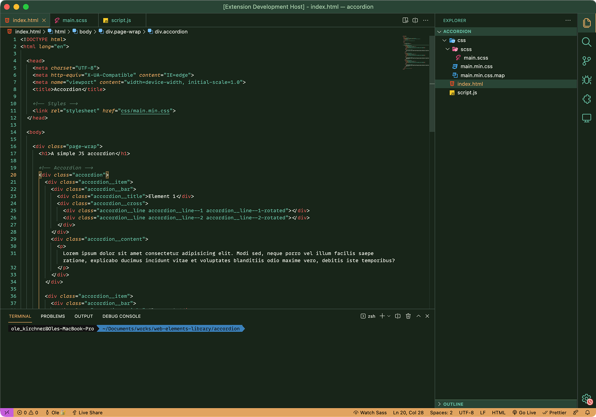
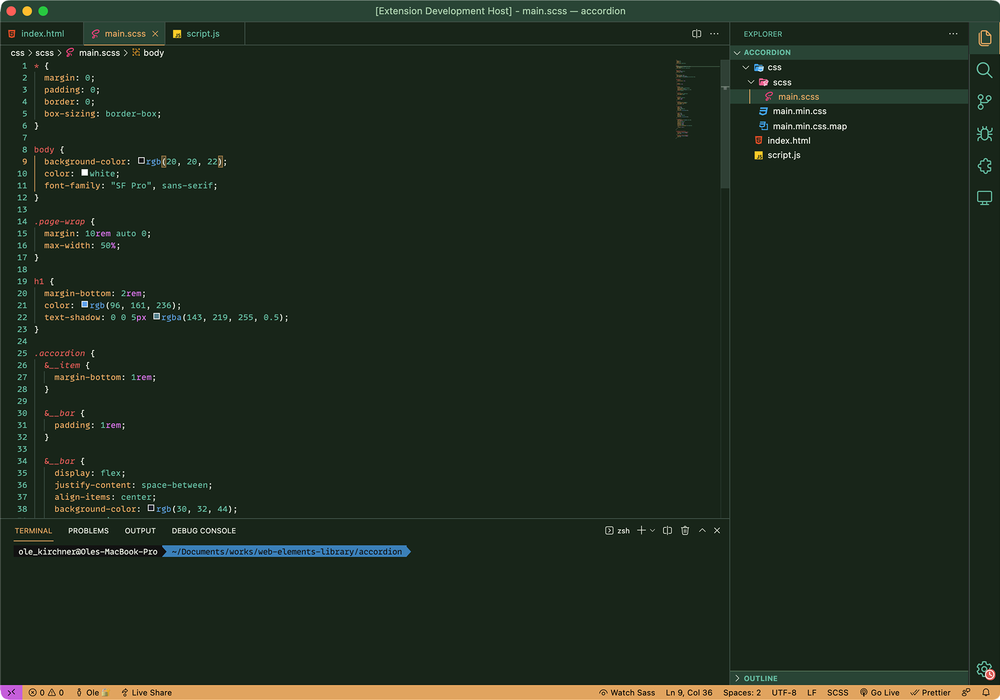
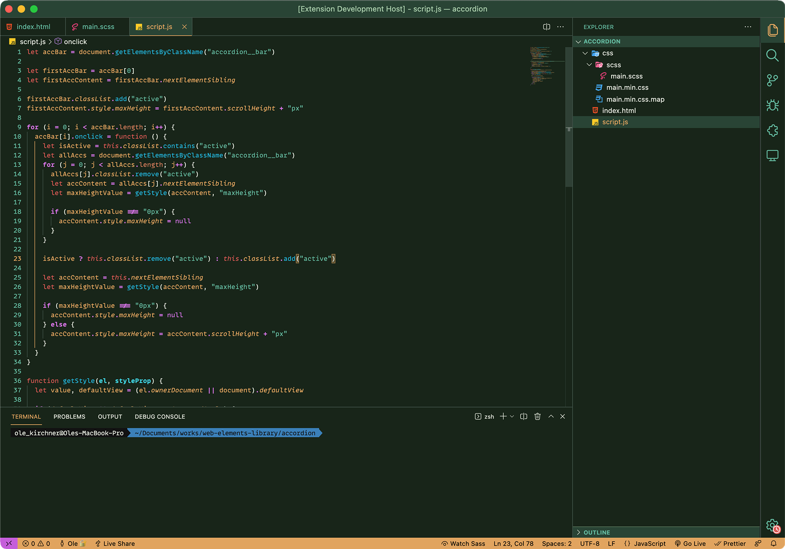

import { ArrowUpRight } from 'lucide-react'

My custom coding theme for VS-Code with a dark green background and botanical colors.

Get it from the <a href="https://marketplace.visualstudio.com/items?itemName=olekirchner.botanical" title="" target="blank">Visual Studio Marketplace<ArrowUpRight size={16} className="relative top-[-1px] left-[1px] inline"/></a>

View project files on <a href="https://github.com/olekirchner/botanical" title="View project files on GitHub" target="blank">GitHub<ArrowUpRight size={16} className="relative top-[-1px] left-[1px] inline"/></a>

  

  

  

