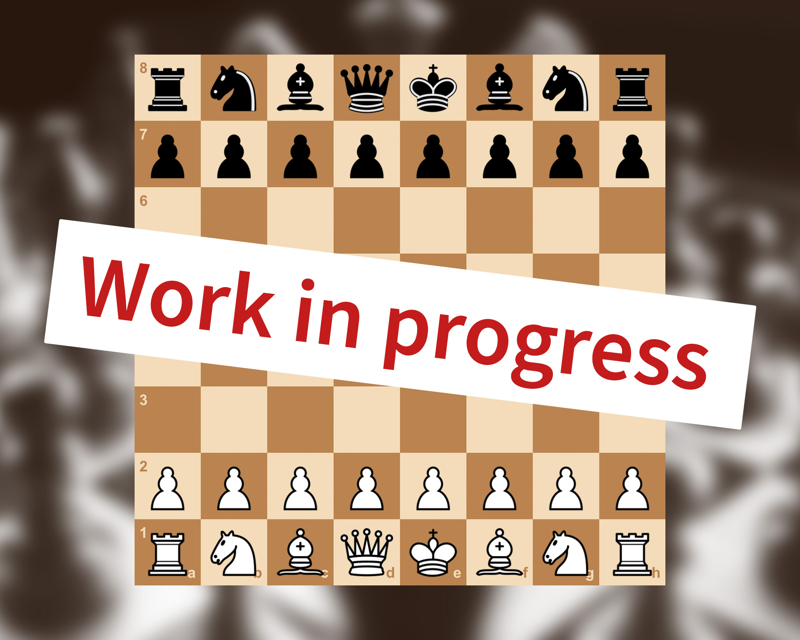

I'm currently working on a chess program using Java, JavaFX and CSS. In this program, all chess rules are implemented and you are able to play against another player on one local PC. It also includes a clock if needed, a couple different board themes and piece sets and a score sheet which keeps track of all the moves.

This will be an ongoing project and I want to implement a chess engine in the future, once I gathered the knowledge needed for this intend, as well as some other helpful features.

<b>Soon to be finished</b>

  

