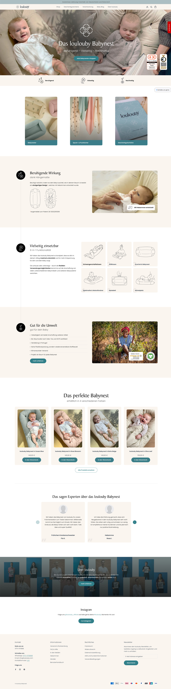

import { ArrowUpRight } from 'lucide-react'

A redesign for the beforehand existing e-commerce shop of the company loulouby, a seller for innovative infant nests, made using HTML, CSS, JS and Liquid in Shopify. The overall shop functionality and main structure of the website were already implemented. I just visually redesigned the site, "cleaned up" the backend, added the reviews widget and enhanced various things.

Live website: <a href="https://loulouby.com/" title="Visit live website" target="blank" rel="noopener">https://loulouby.com/<ArrowUpRight size={16} className="relative top-[-1px] left-[1px] inline"/></a>

<b>Disclaimer:</b> The live version might have changed a lot 
by now and is not under my control anymore, see original design below.

  

