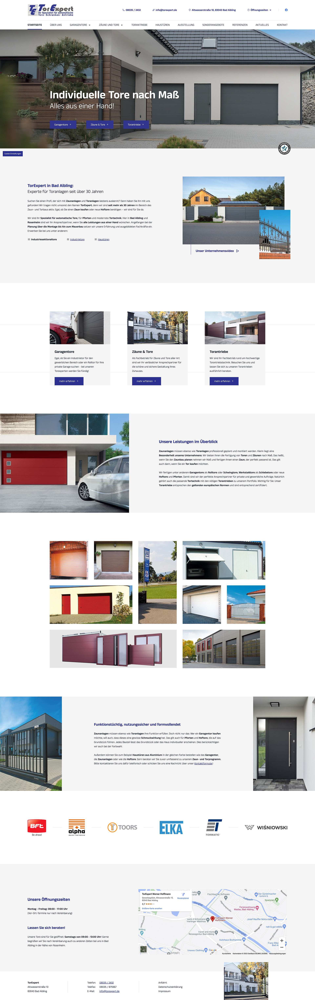

import { ArrowUpRight } from 'lucide-react'

Client work on behalf of the <a href="https://www.wwwe.de/" title="Link to wwwe GmbH homepage" target="blank">wwwe GmbH<ArrowUpRight size={16} className="relative top-[-1px] left-[1px] inline"/></a>. A website for the professional gate-seller for custom made individual gates called "TorExpert", built using HTML, SCSS, JS and the in-house CMS of wwwe.

Live website: <a href="https://torexpert.de" title="Visit live website" target="blank" rel="noopener">https://torexpert.de<ArrowUpRight size={16} className="relative top-[-1px] left-[1px] inline"/></a>

<b>Disclaimer:</b> The live version might have changed a lot 
by now and is not under my control anymore, see original design below.

  

