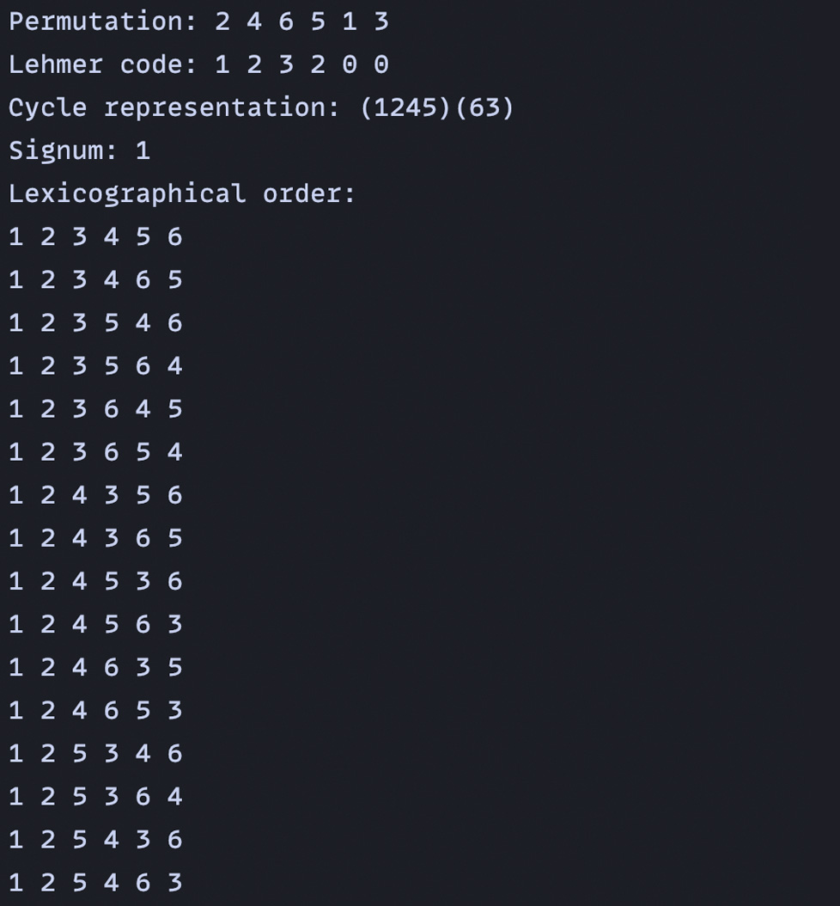
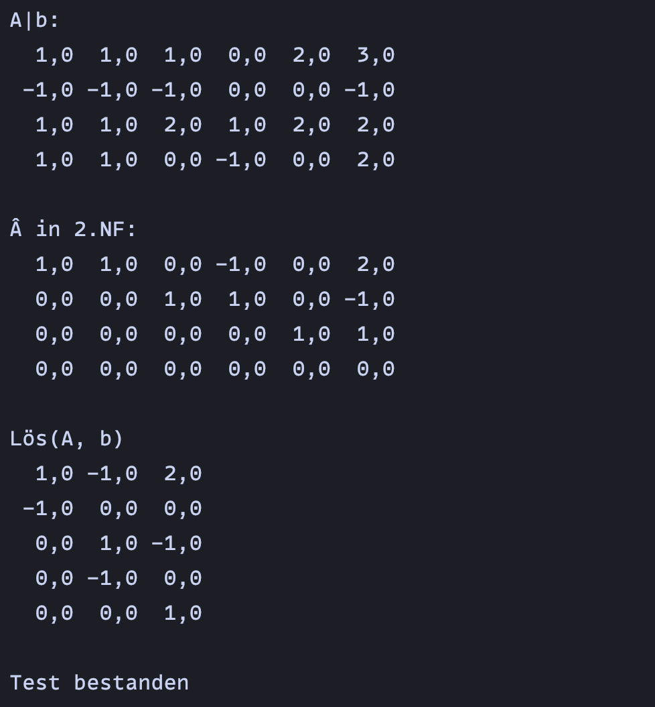

import task1 from '../../../static/gifs/task-1.gif'
import task2 from '../../../static/gifs/task-2.gif'
import task3 from '../../../static/gifs/task-3.gif'
import task4 from '../../../static/gifs/task-4.gif'
import task5 from '../../../static/gifs/task-5.gif'
import task6 from '../../../static/gifs/task-6.gif'

import { ArrowUpRight } from 'lucide-react'

<h2>1. "Basics of digital media" exercises</h2>

Some exercises regarding image and even video manipulation/processing created using <a href="https://imagej.net/ij/" title="Visit the website of ImageJ" target="blank">ImageJ<ArrowUpRight size={16} className="relative top-[-1px] left-[1px] inline"/></a>. There were templates provided, but we had to implement the logic and functionalities regarding the manipulations ourselves.

View files on <a href="https://github.com/olekirchner/various-university-projects/tree/main/GDM_UEBUNG_WS23" title="" target="blank">GitHub<ArrowUpRight size={16} className="relative top-[-1px] left-[1px] inline"/></a>

  

    

    
Ex. 1: Programmatic generation of images

  

  

    

    
Ex. 2: Color transformation and modification

  

  

    

    
Ex. 3: Elementary image processing (pixel operations and error diffusion)

  

  

    

    
Ex. 4: Elementary video overlays

  

  

    

    
Ex. 5: Simple filters/convolutions

  

  

    

    
Ex. 6: Image enlargement

  

<h2>2. Math programming assignments</h2>

The following images are screenshots of two math assignments. 

The first assignment was about permutations. The tasks were to write a method getLehmerCode that returns the lehmer code of p. Then to write a method getPerm that returns the permutation p associated with L(p). And last but not least to write a method that lists the permutations of \{1, 2, ... n} lexicographically.

The second assignment was about solving systems of linear equations. For this, I first needed to write a method called calcNF2 to transform the extended coefficient matrix into the reduced row echelon form. And then I had to implement the method solve which then solves the system and returns the solutions of the homogeneous system and a special solution of the inhomogeneous system. But in the code you'll find many helper methods which are part of the calcNF2 and solve methods.

View files on <a href="https://github.com/olekirchner/various-university-projects/tree/main/MATH" title="" target="blank">GitHub<ArrowUpRight size={16} className="relative top-[-1px] left-[1px] inline"/></a>

  

    

    
Asgmt. 1: Permutations

  

  

    

    
Asgmt. 2: System of linear equations

  

